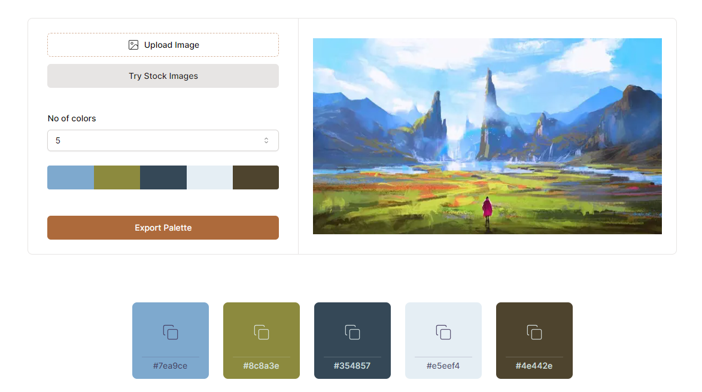

# GetPalette

Generate beautiful color palettes from images



[Live Site](https://getpalette.vercel.app/)

## Built With

- [Next.js](https://nextjs.org/)
- [Tailwind CSS](https://tailwindcss.com/)
- [Shadcn UI](https://ui.shadcn.com/)
- [Zustand](https://zustand-demo.pmnd.rs/)
- [Deta Space](https://deta.space/)

### Installation

To run this project locally,

1. Get your Deta project key at [https://deta.space/](https://deta.space/)
2. Clone the repo

   ```sh
   git clone https://github.com/ajoykumardas12/get-palette.git
   ```

3. Install NPM packages

   ```sh
   npm install
   ```

4. Create a new file `.env.local` in root directory and add

   ```markdown
   NEXT_PUBLIC_ENVIRONMENT="local"
   DETA_PROJECT_KEY="YOUR_PROJECT_KEY"
   ```

## Acknowledgments

- [Initial Image](https://www.freepik.com/free-photo/beautiful-natural-environment-digital-painting_15174562.htm)
- [Stock Images](https://unsplash.com/)
- [Lucide Icons](https://lucide.dev/icons/)
